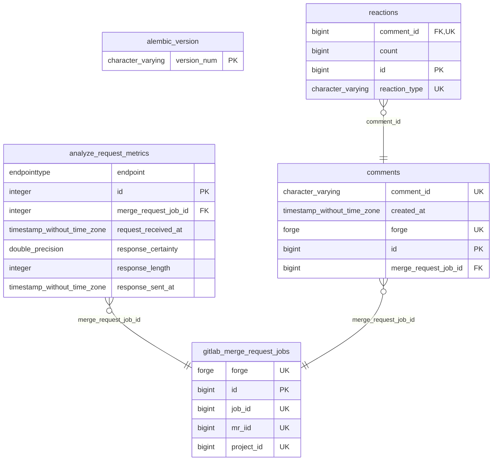

# ER diagram

```mermaid
erDiagram
    alembic_version {
        character_varying version_num PK
    }

    analyze_request_metrics {
        endpointtype endpoint
        integer id PK
        integer merge_request_job_id FK
        timestamp_without_time_zone request_received_at
        double_precision response_certainty
        integer response_length
        timestamp_without_time_zone response_sent_at
    }

    comments {
        character_varying comment_id UK
        timestamp_without_time_zone created_at
        forge forge UK
        bigint id PK
        bigint merge_request_job_id FK
    }

    gitlab_merge_request_jobs {
        forge forge UK
        bigint id PK
        bigint job_id UK
        bigint mr_iid UK
        bigint project_id UK
    }

    reactions {
        bigint comment_id FK,UK
        bigint count
        bigint id PK
        character_varying reaction_type UK
    }

    analyze_request_metrics }o--|| gitlab_merge_request_jobs : "merge_request_job_id"
    comments }o--|| gitlab_merge_request_jobs : "merge_request_job_id"
    reactions }o--|| comments : "comment_id"
```
