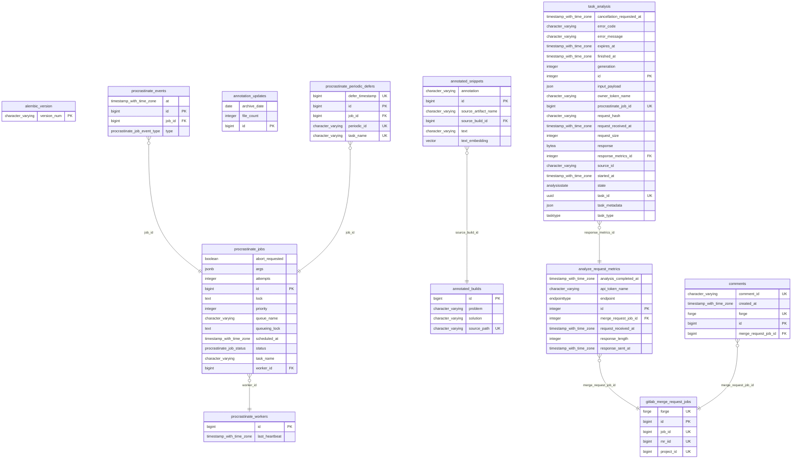

# ER diagram

```mermaid
erDiagram
    alembic_version {
        character_varying version_num PK
    }

    analyze_request_metrics {
        timestamp_with_time_zone analysis_completed_at
        character_varying api_token_name
        endpointtype endpoint
        integer id PK
        integer merge_request_job_id FK
        timestamp_with_time_zone request_received_at
        integer response_length
        timestamp_with_time_zone response_sent_at
    }

    annotated_builds {
        bigint id PK
        character_varying problem
        character_varying solution
        character_varying source_path UK
    }

    annotated_snippets {
        character_varying annotation
        bigint id PK
        character_varying source_artifact_name
        bigint source_build_id FK
        character_varying text
        vector text_embedding
    }

    annotation_updates {
        date archive_date
        integer file_count
        bigint id PK
    }

    comments {
        character_varying comment_id UK
        timestamp_with_time_zone created_at
        forge forge UK
        bigint id PK
        bigint merge_request_job_id FK
    }

    gitlab_merge_request_jobs {
        forge forge UK
        bigint id PK
        bigint job_id UK
        bigint mr_iid UK
        bigint project_id UK
    }

    procrastinate_events {
        timestamp_with_time_zone at
        bigint id PK
        bigint job_id FK
        procrastinate_job_event_type type
    }

    procrastinate_jobs {
        boolean abort_requested
        jsonb args
        integer attempts
        bigint id PK
        text lock
        integer priority
        character_varying queue_name
        text queueing_lock
        timestamp_with_time_zone scheduled_at
        procrastinate_job_status status
        character_varying task_name
        bigint worker_id FK
    }

    procrastinate_periodic_defers {
        bigint defer_timestamp UK
        bigint id PK
        bigint job_id FK
        character_varying periodic_id UK
        character_varying task_name UK
    }

    procrastinate_workers {
        bigint id PK
        timestamp_with_time_zone last_heartbeat
    }

    task_analysis {
        timestamp_with_time_zone cancellation_requested_at
        character_varying error_code
        character_varying error_message
        timestamp_with_time_zone expires_at
        timestamp_with_time_zone finished_at
        integer generation
        integer id PK
        json input_payload
        character_varying owner_token_name
        bigint procrastinate_job_id UK
        character_varying request_hash
        timestamp_with_time_zone request_received_at
        integer request_size
        bytea response
        integer response_metrics_id FK
        character_varying source_id
        timestamp_with_time_zone started_at
        analysisstate state
        uuid task_id UK
        json task_metadata
        tasktype task_type
    }

    analyze_request_metrics }o--|| gitlab_merge_request_jobs : "merge_request_job_id"
    task_analysis }o--|| analyze_request_metrics : "response_metrics_id"
    annotated_snippets }o--|| annotated_builds : "source_build_id"
    comments }o--|| gitlab_merge_request_jobs : "merge_request_job_id"
    procrastinate_events }o--|| procrastinate_jobs : "job_id"
    procrastinate_jobs }o--|| procrastinate_workers : "worker_id"
    procrastinate_periodic_defers }o--|| procrastinate_jobs : "job_id"
```
