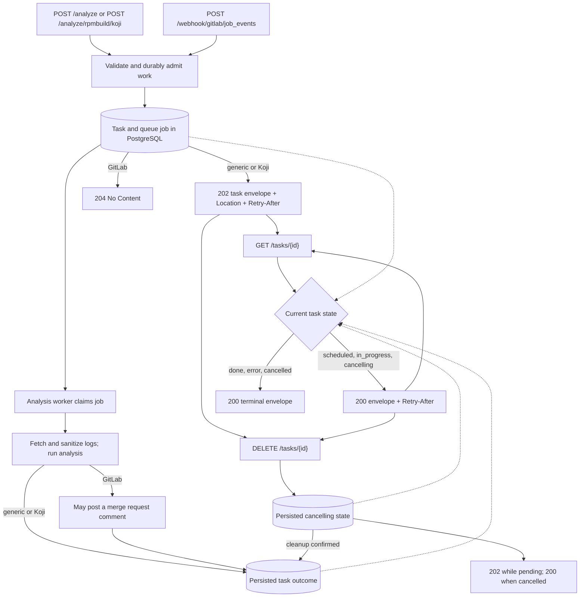
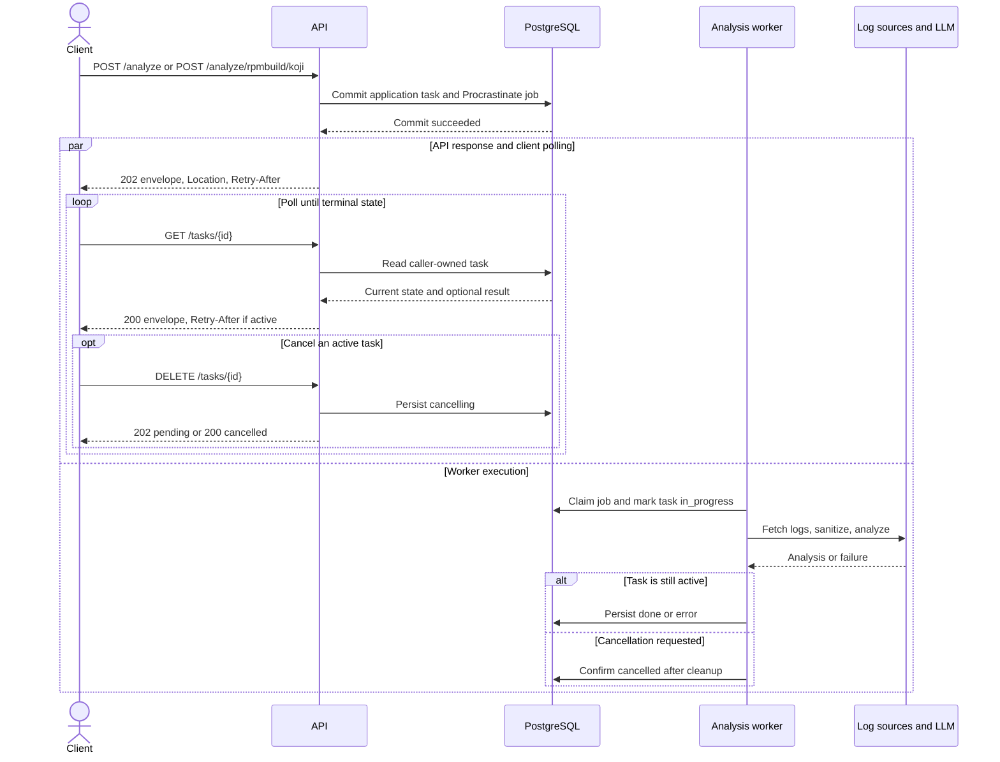

# API guide

Log Detective exposes asynchronous analysis endpoints. See the
[README](../README.md#server) for local setup. A running server also serves the
generated endpoint and field reference at `/docs` and `/openapi.json`.

## Workflow

For new work, the API commits the application task and its Procrastinate job in
one database transaction before acknowledging the request. The worker then
processes the job independently. Generic and Koji callers can poll or cancel
their task; GitLab webhooks receive an acknowledgement without a public task URL.



An identical retry with a client-supplied task ID reuses the existing task and
does not enqueue another job. See [Task responses](#task-responses) for status
and cancellation details.

### Time-ordered UML sequence

This example follows a generic or Koji request. Time moves downward; the
worker can start as soon as admission commits, while the client receives the
`202` response and polls independently. Elapsed time is not drawn to scale.



The GitLab webhook uses the same durable admission and worker path, but its
acknowledgement is `204 No Content` and it does not expose a polling URL.

## Authentication

Log Detective supports multiple named bearer tokens without putting secrets in
`server/config.yml`. Copy `server/api_tokens.yml.example` to
`server/api_tokens.yml`, replace every example value with a long random token,
and restrict the file so that only the service account can read it. The file is
a YAML mapping whose keys are stable client names and whose values are secret
tokens:

```yaml
packit: "secret-token-for-packit"
monitoring: "different-secret-token"
```

Set `LOGDETECTIVE_TOKENS_FILE` to the file's path and mount it read-only when
running in a container. Clients authenticate with `Authorization: Bearer TOKEN`.
Token names and values must be non-empty and unique, and token values must not
have leading or trailing whitespace; duplicate token names are rejected rather
than overwritten. An invalid configured file prevents server startup. When the
variable is unset, global bearer authentication is disabled for local
development; configured Koji and GitLab token checks still apply. Bearer
authentication covers application routes, including the GitLab webhook, but
FastAPI's built-in `/docs`, `/redoc`, and `/openapi.json` routes remain public.

Only the token name is saved with analysis metrics. Token values are never
stored in the database or included in authentication errors.

## Submitting an analysis

API allows for submission of multiple build artifacts for analysis.
These can be provided using URLs or as raw strings.

```sh
curl --header "Content-Type: application/json" --request POST \
     --data '{
          "files": [
            {
                "name": "build.log",
                "url": "https://url.to/build.log"
            },
            {
                "name": "raw_string.log",
                "content": "Raw string that will be analyzed."
            }
        ],
        "build_metadata": {
            "specfile": null,
            "last_patch": null,
            "commentary": "BuildError: error building package (arch noarch), mock exited with status 30; see root.log for more information",
            "infra_status": null
        }
     }' \
     http://localhost:8080/analyze
```

`files` must contain 1–15 artifacts with distinct names.
Use `url` to fetch a remote HTTP(S) log, or `content` to submit the log text
itself. Remote URLs cannot contain parameters, a query, or a fragment.
Analysis submissions require a valid `Content-Length` header; the declared
request size must fit within `general.max_artifact_size` in
`server/config.yml`. A missing or invalid length returns `411`, and an
oversized length returns `413`. A URL that parses but violates the remote URL
restrictions returns `400`; malformed URLs and other request-model validation
failures return `422`.

Remote artifacts are also size-checked as their bytes are downloaded, even if
the remote server omits `Content-Length` or reports a smaller size. This check
runs in the worker after the analysis request has been accepted.

`build_metadata.commentary` and `build_metadata.infra_status` provide context to
the agent; `specfile` and `last_patch` are accepted but currently unused.

### Task responses

Analysis endpoints use asynchronous request/reply. A successful `POST` returns
`202 Accepted`, a `Location` header pointing to `/tasks/{id}`, and a
`Retry-After` header. The JSON response is a stable task envelope; it does not
contain an analysis result until processing finishes:

```json
{
  "id": "7d036221-ec50-4d31-b714-09edaccf1486",
  "taskType": "generic",
  "createdAt": "2026-09-18T10:00:00Z",
  "status": "scheduled",
  "error": null,
  "result": null
}
```

Poll the URL in `Location` with `GET`. It returns `200` and the same envelope
while `status` is `scheduled`, `in_progress`, or `cancelling`, including
`Retry-After` while more polling is useful. A terminal response has status
`done`, `error`, or `cancelled`; `result` is populated only for `done`.
Cancel an owned operation with `DELETE /tasks/{id}`. Cancellation returns
`202` while process cleanup is pending and `200` once cancellation is
confirmed. Clients may supply a UUIDv4 as the request body's optional `id`;
repeating the identical request with that ID returns the original operation,
while reusing it for different input or credentials returns `409`. Once the
original operation expires, retries using its ID return `409` until retention
cleanup removes the record; use a new ID to submit a new operation.

### Koji and GitLab

Koji analysis follows the same contract through
`POST /analyze/rpmbuild/koji` with a body such as
`{"kojiInstance": "fedora", "taskId": 123}`. The instance must be configured.
A completed Koji task's `result` contains `task_id`, `log_file_name`, and a
nested `response` with the analysis. The former Koji path-ID endpoints and
callback header are removed.

> **Note:** If the server operator configured tokens for a Koji instance,
> authorized clients must send one in `X-Koji-Token`. These are Log Detective
> endpoint secrets, not Koji user credentials.

Run [scripts/test_request.sh](../scripts/test_request.sh) on Linux with Bash,
curl, jq, two Koji task URLs in `TASK_URLS`, and a local server with a configured
Koji instance and analysis worker. The script sends no authentication headers,
so global bearer and Koji token checks must be disabled. It tests concurrent
submission, retries, conflicts, polling, and cancellation, and saves responses
under `test_results/` by default.

GitLab uses `POST /webhook/gitlab/job_events` when at least one instance is
configured. It requires `X-Gitlab-Instance` set to a recognized, configured
forge URL. The webhook returns `204` after durable queue admission and has no
public task resource. An expired GitLab source still awaiting retention cleanup
receives `409` on redelivery.

> **Note:** If the server operator configures webhook secrets for that GitLab
> instance, the GitLab webhook must send one in `X-Gitlab-Token`. This webhook
> secret is distinct from the API token the server uses to call GitLab.

Before sending logs to the LLM, Log Detective redacts some personal
identifiers, including email addresses and GPG fingerprints.

## Metrics

You can query request and response statistics via `metrics` endpoints
using `GET` method at `/metrics/ENDPOINT_TYPE/`. The endpoint returns data
in JSON format with a `metrics` list of dictionaries containing metadata
about endpoint type and time series of data aggregated at the given granularity.
For asynchronous generic and Koji analysis, response time measures durable queue
admission through the initial `202 Accepted` response. For GitLab webhooks, it
measures admission through the `204 No Content` acknowledgement. Completion
time runs from request receipt to the terminal outcome, including time waiting
in the queue. Response length measures the serialized analysis result in
characters when one is available, rather than the initial HTTP acknowledgement.

1. `ENDPOINT_TYPE`: `analyze`, `analyze-koji`, or `analyze-gitlab`.
2. `start_time`: Timestamp, indicating inclusive start of the query
3. `end_time`: Optional exclusive timestamp, defaults to current UTC time
4. `time_period`: Granularity of the aggregation, 'hour', 'day' or 'month'.

Use the optional `api_token_name` query parameter to restrict statistics to a
single named token. Without it, statistics include all tokens and historical
records without token attribution.

Example calls:

```sh
curl "http://localhost:8080/metrics/analyze-gitlab/?start_time=2026-09-01T00:00:00Z&time_period=day"
curl "http://localhost:8080/metrics/analyze/?start_time=2026-09-01T00:00:00Z&end_time=2026-09-08T00:00:00Z&time_period=day&api_token_name=packit"
```

Example response:

```json
{
  "metrics": [
    {
      "endpoint": "analyze",
      "period_start": [],
      "total_count": [],
      "average_response_time": [],
      "average_response_len": [],
      "average_completion_time": []
    }
  ]
}
```

## Worked example

Log Detective can work with any logs, though we optimize it for RPM build logs.
The analysis output below is an excerpt of the `result` field from a completed
`GET /tasks/{id}` response. The initial `POST /analyze` returns the task
envelope shown in [Task responses](#task-responses).

The analyzed build: https://koji.fedoraproject.org/koji/taskinfo?taskID=149750933

You can get similar output by running this on your local compose:

```sh
curl --header "Content-Type: application/json" --request POST \
     --data '{
        "files": [
            {
                "name": "root.log",
                "url": "https://kojipkgs.fedoraproject.org//work/tasks/933/149750933/root.log"
            },
            {
                "name": "mock_output.log",
                "url": "https://kojipkgs.fedoraproject.org//work/tasks/933/149750933/mock_output.log"
            },
            {
                "name": "build.log",
                "url": "https://kojipkgs.fedoraproject.org//work/tasks/933/149750933/build.log"
            }
        ],
        "build_metadata": {
            "specfile": null,
            "last_patch": null,
            "commentary": "Logs are from a Koji build.\nKoji builds use mock chroots; build.log contains build output,\nroot.log has dependency resolution and mock setup.",
            "infra_status": null
        }
     }' \
     http://localhost:8080/analyze
```

Note that only a handful of snippets were selected from the original response for demonstration purposes:

```json
{
  "explanation": "The build failed during the compilation phase of `emacs-with-editor` because the build process could not find a required load file, specifically `cond-let`, while compiling `with-editor.el` (build.log, line 104). This indicates a missing dependency or an incomplete build environment setup for Emacs Lisp components.",
  "no_issue_found": false,
  "snippets": [
    {
      "line_number": 585,
      "source_file": "root.log",
      "text": "DEBUG util.py:535:  Warning: skipped OpenPGP checks for 124 packages from repository: build"
    },
    {
      "line_number": 5276,
      "source_file": "root.log",
      "text": "DEBUG util.py:535:  Package \"emacs-1:31.1-2.fc46.ppc64le\" is already installed."
    },
    {
      "line_number": 3,
      "source_file": "mock_output.log",
      "text": "INFO: mock.py version 6.8 starting (python version = 3.14.7, NVR = mock-6.8-1.fc44), args: /usr/libexec/mock/mock -r koji/f46-build-70856970-6688917 --new-chroot --init"
    },
    {
      "line_number": 275,
      "source_file": "mock_output.log",
      "text": "INFO: Buildroot is handled by package management installed into bootstrap:\n  rpm-6.1.0-1.fc46.ppc64le\n  rpm-sequoia-1.10.2-5.fc45.ppc64le\n  dnf5-5.4.3.0-2.fc46.ppc64le\n  dnf5-plugins-5.4.3.0-2.fc46.ppc64le"
    },
    {
      "line_number": 287,
      "source_file": "mock_output.log",
      "text": "ERROR: Exception(/var/tmp/koji/tasks/933/149750933/local/work/tasks/907/149750907/emacs-with-editor-3.5.4-1.fc46.src.rpm) Config(f46-build-70856970-6688917) 3 minutes 59 seconds"
    },
    {
      "line_number": 289,
      "source_file": "mock_output.log",
      "text": "ERROR: Command failed: \n # /usr/bin/systemd-nspawn -q -M ee22ca6a19f040769a6c490430569274 -D /var/lib/mock/f46-build-70856970-6688917/root -a -u mockbuild --capability=cap_ipc_lock --capability=cap_mac_admin --bind=/dev/btrfs-control --bind=/dev/mapper/control --bind=/dev/fuse --bind=/dev/loop-control --bind=/dev/loop0 --bind=/dev/loop1 --bind=/dev/loop2 --bind=/dev/loop3 --bind=/dev/loop4 --bind=/dev/loop5 --bind=/dev/loop6 --bind=/dev/loop7 --bind=/dev/loop8 --bind=/dev/loop9 --bind=/dev/loop10 --bind=/dev/loop11 --resolv-conf=off --console=pipe --setenv=TERM=vt100 --setenv=SHELL=/bin/bash --setenv=HOME=/builddir --setenv=HOSTNAME=mock --setenv=PATH=/usr/bin:/bin:/usr/sbin:/sbin '--setenv=PROMPT_COMMAND=printf \"\\033]0;<mock-chroot>\\007\"' '--setenv=PS1=<mock-chroot> \\s-\\v\\$ ' --setenv=LANG=C.UTF-8 bash --login -c '/usr/bin/rpmbuild -bb --noclean --target noarch --nodeps /builddir/build/SPECS/emacs-with-editor.spec'"
    },
    {
      "line_number": 118,
      "source_file": "build.log",
      "text": "Cannot find a locale compatible with document strings translations"
    },
    {
      "line_number": 133,
      "source_file": "build.log",
      "text": "RPM build errors:"
    },
    {
      "line_number": 134,
      "source_file": "build.log",
      "text": "error: Bad exit status from /var/tmp/rpm-tmp.Us2T6p (%build)\n    Bad exit status from /var/tmp/rpm-tmp.Us2T6p (%build)"
    }
  ],
  "solution": "Ensure that all necessary Emacs Lisp development dependencies, including any required libraries that provide `cond-let`, are correctly installed and available in the build environment before running the build process."
}
```

The most significant field for diagnosis is `explanation`, a plain text string.
`solution` is a plain text string when a fix is suggested, or `null` otherwise.
